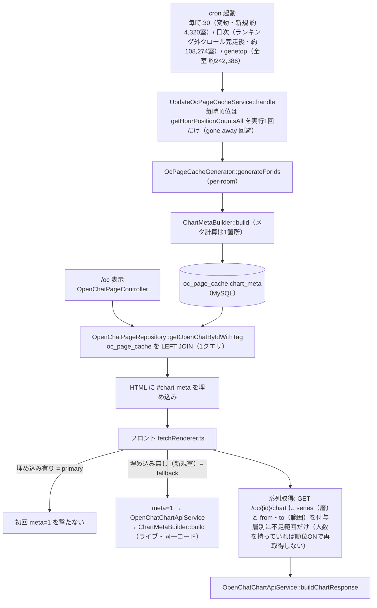
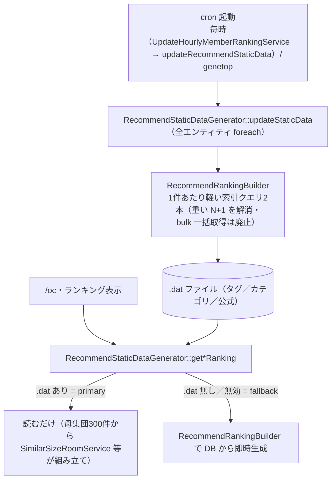

# オプチャグラフ（OpenChat Graph）

LINE OpenChatのメンバー数推移を可視化し、トレンドを分析するWebサービス

**🌐 公式サイト**: https://openchat-review.me
**ライセンス**: MIT
**言語:** [日本語](README.md) | [English](README_EN.md)

---

## 🤖 AIアシスタントからデータを使う（MCPサーバー・認証不要）

ChatGPT・Claude などの AI アシスタントから、オプチャグラフの統計データ（約24万室のメンバー数推移・成長ランキング・LINE公式ランキング順位履歴）を直接利用できる MCP (Model Context Protocol) サーバーを公開しています。登録・申請・料金は不要、設定は URL を1行貼るだけです。

```
https://openchat-review.me/mcp
```

- 一般向けの使い方: [AI連携（MCP）の使い方](https://openchat-review.me/mcp)（同URLをブラウザで開くと案内ページ）
- 技術仕様・SQL例: [API_README.md](API_README.md)
- サイト概要の機械可読版: [llms.txt](https://openchat-review.me/llms.txt)

---

## 🚀 開発環境のセットアップ

### 必要なツール

- Docker with Compose V2 (`docker compose` コマンド)
- mkcert（SSL証明書生成用）

### 初回セットアップ

```bash
# SSL証明書生成 + 初期設定
make init

# 基本環境を起動
make up
```

#### `make init` の動作

- SSL証明書を生成（mkcert）
- `local-secrets.php` が存在しない場合、自動的にセットアップスクリプトを実行
- MySQLコンテナが停止している場合、自動的に起動→セットアップ→停止
- **初期状態**（データベースとSQLiteファイルが存在しない）の場合、確認なしで自動実行

**引数を渡す:**

```bash
# 対話型（デフォルト）
make init

# 確認なしでDB・storage初期化、local-secrets.phpも作成
make init-y

# 確認なしでDB・storage初期化、local-secrets.phpは保持
make init-y-n
```

**起動時に ERROR: No such service: build が出た場合**
以下のコマンドで再ビルド
`docker compose -f docker-compose.yml -f docker-compose.mock.yml --verbose build --no-cache`

#### セットアップスクリプトの手動実行

既存の環境をリセットする場合：`./setup/local-setup.default.sh` (オプション: `-y` 確認なし、`-n` local-secrets.php保持、`-h` ヘルプ)

### 環境の種類

**基本環境（make up）:**

- 実際のLINEサーバーにアクセス（インターネット接続必要）

**Mock付き環境（make up-mock）:**

- LINE Mock APIを含む開発環境
- Docker Composeのサービス名（line-mock-api）でMock APIにアクセス
- インターネット接続不要
- データ件数・遅延・Cron自動実行を制御可能

### 利用可能なコマンド

**基本環境:**

```bash
make up        # 起動
make down      # 停止
make restart   # 再起動（基本・Mock自動判定）
make rebuild   # 再ビルドして起動（基本・Mock自動判定）
make ssh       # コンテナにログイン（基本・Mock両対応）
```

**Mock付き環境:**

```bash
make up-mock      # 起動（docker/line-mock-api/.env.mockの設定を使用）
make cron         # Cron有効化（毎時30/35/40分に自動クローリング）
make cron-stop    # Cron無効化
```

**テスト・CI・静的解析:**

```bash
make ci-test   # CI環境でテストを実行（ローカル専用）
make phpstan   # PHPStan静的解析を実行
```

### 本番データを取り込みたい場合（任意）

通常の開発は `make up` / `make up-mock` で完結する。本番データのミラーが必要なときだけ以下を使う。

```bash
make sync-setup   # 初回: 本番からフル取得 + DATA_PROTECTION=true に切替
make sync-update  # 以降の差分更新（rsync差分転送 + 派生DBローカル再構築）
```

**実行後の状態:**

- `.env` の `DATA_PROTECTION=true`（`make init`, `make ci-test`, `make up-mock` は実行不可になる）
- MySQL は全 DB を本番ミラーで上書き、SQLite/画像/派生キャッシュもローカルに同期
- ローカル app は同期中の数分間、MySQL 再インポートのため一時的に応答不可（SQLite 読みは継続）

**アクセス権について:**

機密（SSH鍵・本番DBパスワード等）は `make sync-*` 実行時にプライベートリポから自動取得される。
アクセス権が無いと取得失敗 → `batch/sh/prod-sync/secrets-example/` の雛形を書き換えるか、
自前のリポを `PROD_SYNC_CONFIG_URL=...` で指定して使う（エラー時に手順が表示される）。

**その他:**

```bash
make show      # 現在の起動モード・設定表示
make help      # 全コマンド表示
```

**Cron自動実行モード:**

- 毎時30分: 日本語クローリング
- 毎時35分: 繁体字中国語クローリング
- 毎時40分: タイ語クローリング

### アクセスURL

**基本環境（make up）:**

- HTTPS: https://localhost:8443
- phpMyAdmin: http://localhost:8080
- MySQL: localhost:3306

**Mock付き環境（make up-mock）:**

- HTTPS（基本）: https://localhost:8443
- HTTPS（Mock）: https://localhost:8543
- phpMyAdmin: http://localhost:8080
- MySQL: localhost:3306（共有）
- LINE Mock API: http://localhost:9000

MySQLコマンド例: `docker compose exec mysql mysql -uroot -ptest_root_pass -e "SELECT 1"`

**注意:**

- HTTPは自動的にHTTPSにリダイレクトされます
- 両環境でMySQLデータベースは共有されます

### Xdebugの有効化

デフォルトでは**Xdebugは無効**です。デバッグが必要な場合のみ有効化してください：

```bash
# 起動時に有効化
ENABLE_XDEBUG=1 make up
ENABLE_XDEBUG=1 make up-mock
```

### CI環境

**GitHub Actionsで自動テストを実行:**

- `.github/workflows/ci.yml`: PRマージ前に自動実行
- `docker-compose.ci.yml`: CI専用設定（SSL無効、Xdebug無効）
- Docker Layer Caching: 2回目以降のビルドを高速化

**ローカルでCIテストを実行:**

```bash
make ci-test
```

**CIテストとデプロイをスキップ:**
緊急修正やドキュメント更新など、CIテストとデプロイを実行せずにmainにマージしたい場合：

- PRに `skip-ci` ラベルを付ける
- またはPRタイトルの先頭に `skip-ci:` を追加

例: `skip-ci: READMEの誤字修正`

注意: `skip-ci` を使用すると、CIテストがスキップされ、本番環境へのデプロイも実行されません。

### テストスクリプト

Mock環境で時刻を進めながらクローリングをテスト：

```bash
# CI用（高速・効率的）
./test-ci.sh
# - 固定データ（80件/カテゴリ）、遅延なし
# - 日常的なテスト・CI環境用
# - クローリング完了後、自動的にデータ検証を実行

# デバッグ用（本番環境に近い設定）
./test-cron.sh
# - 大量データ（10万件）、本番並み遅延
# - 48時間テストに対応、本番環境の挙動を再現
```

**実行回数設定:** `docker/line-mock-api/.env.mock` で `TEST_JA_HOURS`（日本語）、`TEST_TW_HOURS`（繁体字）、`TEST_TH_HOURS`（タイ語）を変更

**データ検証:** `./.github/scripts/verify-test-data.sh` で以下を確認

- MySQLテーブルのレコード数:
  - `ocgraph_comment.open_chat`: 2000件以上
  - `ocgraph_ocreviewth.open_chat`: 1000件以上
  - `ocgraph_ocreviewtw.open_chat`: 1000件以上
  - `ocgraph_ocreview.statistics_ranking_hour`: 10件以上
  - `ocgraph_ocreview.statistics_ranking_hour24`: 10件以上
  - `ocgraph_ocreview.user_log`: 0件
  - `ocgraph_graph.recommend`: 500件以上

---

## ⚠️ トラブルシューティング

### SQLiteファイルをコンテナ間でコピーした後に `SQLITE_READONLY` エラーが出る

別のコンテナや環境からSQLiteの`.db`ファイルを`storage/`にコピーした場合、以下のエラーが発生することがある:

```
PDOException: SQLSTATE[HY000]: General error: 8 attempt to write a readonly database
```

**原因**: SQLiteはWALモードで動作しており、SELECTでも`-shm`/`-wal`ファイルをディレクトリに新規作成する必要がある。コピーしたファイルのownerがコンテナ内のPHPプロセスユーザー（`www-data`）と異なり、かつディレクトリに書き込み権限がないため、ファイル作成に失敗する。

**対処法**: `.db`ファイルとディレクトリの両方にwww-dataの書き込み権限を付与する:

```bash
docker compose exec app sh -c 'find /var/www/html/storage -name "*.db" -exec chown www-data:www-data {} + && find /var/www/html/storage/*/SQLite -type d -exec chmod 777 {} +'
```

---

## 🏗️ 技術スタック

- PHP 8.5 + [MimimalCMS](https://github.com/mimimiku778/MimimalCMS)（自作MVCフレームワーク）
- MySQL/MariaDB + SQLite
- React + TypeScript + Vite / Create React App

### フロントエンド

ソースコードは `frontend/` 配下にあり、ビルド成果物は `public/js/` に出力されます（gitignored）。

```
frontend/
├── stats-graph/  → public/js/chart/   (Vite + Preact, グラフ表示)
├── ranking/      → public/js/react/   (Create React App, ランキング)
└── comments/     → public/js/comment/ (Vite + React, コメント)
```

```bash
# 全フロントエンドをビルド（make init でも自動実行）
make build-frontend

# 個別にビルド
cd frontend/stats-graph && npm install && npm run build
```

デプロイ時はGitHub Actionsでビルドし、SCPで本番サーバーに配置します。

### フロントエンド開発（HMR + プロキシ）

バックエンド（`make up` または `make up-mock`）を起動した状態で、各フロントエンドを個別にdev serverで起動できます。
Viteプロキシ/CRAプロキシによりAPIリクエストがバックエンド（`https://localhost:8443`）に転送されるため、CORSエラーは発生しません。

```bash
# コメント (Vite + React, http://localhost:5173)
cd frontend/comments && npm install && npm run dev

# グラフ (Vite + Preact, http://localhost:5173)
cd frontend/stats-graph && npm install && npm run dev

# ランキング (CRA, http://localhost:3000)
cd frontend/ranking && npm install && npm start
```

プロキシ先のポートはリポジトリルートの `.env`（`HTTPS_PORT`）から自動的に読み取られます（docker-composeと同じ設定を共有）。

## 🗄️ DBにテーブル・カラムを追加したいとき

`setup/schema/mysql/*.sql` を編集するだけ。デプロイ時に、不足しているテーブル・カラム・索引が
各DBへ「追加だけ」自動反映されます（既存データは壊しません。削除・型変更はしません）。
`deploy.yml` もコードも触る必要はありません。

```bash
# 反映される内容を事前確認（DBは変更しない）
docker compose exec app php batch/exec/sync_mysql_schema.php --dry-run
```

詳細・注意点は [`app/Services/Schema/README.md`](app/Services/Schema/README.md) を参照。

## 📁 ディレクトリ構造

```
app/
├── Config/         # ルーティング・設定
├── Controllers/    # HTTPハンドラー
├── Models/         # リポジトリ・DTO
├── Services/       # ビジネスロジック
│   └── Crawler/    # クローラー関連（Config含む）
└── Views/          # テンプレート
frontend/           # フロントエンドソース（ビルド → public/js/）
shadow/             # MimimalCMSフレームワーク
batch/              # Cronジョブ・バッチ処理
shared/             # DI設定
storage/            # SQLite・ログ・キャッシュ
```

---

## 🗂️ ページ系キャッシュの生成アーキテクチャ

`/oc` 等の表示を軽くするため、重い計算は cron で事前計算して保存し、表示時はそれを読むだけにしている。
共通の考え方は「事前計算 → 保存 → 表示は読むだけ／無ければその場で生成（フォールバック）」。2系統ある。

### グラフのメタ・系列（`oc_page_cache.chart_meta`／MySQL）

グラフ初回表示のタブ・ボタン出し分け判定（可用性メタ）を cron で事前計算して `oc_page_cache.chart_meta`
に持たせ、`/oc` の既存1クエリで一緒に読んでHTMLに埋め込む。系列データ（人数・順位・ローソク足）は
`?series=` で層別に「見えている期間の不足分だけ」取得する。



- 生成タイミング: 毎時（直近1時間で変動した室＋新規ランク入り）／日次（`getForDaily`＝変動8日＋新規＋週次更新。ランキング外クロール完走後に走る）／genetop（全室）。最長でも約1週間で全室が一巡する。
- フォールバック: 未生成室（新規室・初回バックフィル前）は埋め込みが無いので `meta=1` で同じ `ChartMetaBuilder` をライブ実行。primary（cron）と同一コードなので結果は一致する。

### おすすめ・ランキング（`.dat` ファイル）

おすすめ／カテゴリ／公式ランキングを事前計算して `.dat` に保存し、表示時は読むだけにする。



- かつては「タグ1件ごとに重い結合クエリを1本」投げる N+1 構造で、毎時バッチが1時間で完走せず次回に
  kill され続け、生成中に重いクエリを投げ続けて `/oc` 表示が「MySQL server has gone away」を多発させていた。
  現在は1件あたり軽い索引クエリ2本に置き換えて解消（bulk 一括取得も試したが廃止）。
- フォールバック: `.dat` が無い／無効なら DB から即時生成して表示する。

---

## 📞 連絡先

- Email: support@openchat-review.me
- X (Twitter): [@openchat_graph](https://x.com/openchat_graph)
